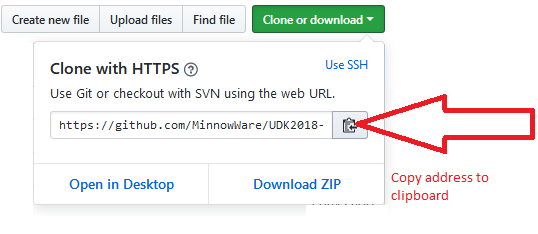
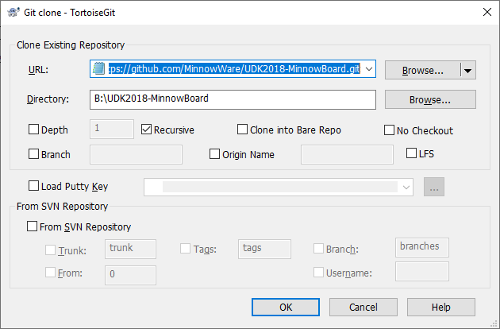

# UDK2018-Minnowboard

## Goal
1. Get the MinnowBoard running with UDK2018 and VS2019.
2. Demonstrate the **_CdePkg_** for *Standard C Library* conform Hosted Environment for UEFI driver development

NOTE: Visual Studio is here only used for editing the project. The build process is still pure EDK!
      (the startup error message of VS2017/VS2019 can be ignored)

## HowTo
1. install a build machine according to https://github.com/MinnowWare/HowTo-setup-an-UEFI-Development-PC
2. get the GIT repository WebURL

  
  
3. in the file explorer open the builddrive

4. right click to open the context menu -> Git clone

  

5. download the repository

6. run startBldEnv.bat

7. To build the EDK emulation:

       "BUILD -t VS2019" to build the EDK2
       
       "rd /s /q build" to clean previous build
       
       "start DBG" to start the UEFI BIOS EMULATION

8. To build the MinnowBoard:
		cd ..\edk2-platforms\Vlv2TbltDevicePkg
		
		Build_IFWI.bat MNW2 Release
		
		(the BIOS binary is placed in the STITCH directory)

**NOTE: EDKEmu build and MinnowBoard build CAN NOT be used alternating in the
      same command box.**

## Known Bugs
1. *Capsule* doesn't work.
2. before BIOS build previous *CdePkg* build and FV files has to be deleted manually (clrCdePkgBuild.bat)

## Revision History

### 20190730\Branch CdeValPkg
* add all <em>CTYPE.H()< / em> -functions to PEI post phase

###	20190728\Branch CdeValPkg
* add all <em>CTYPE.H</em>-functions for DXE

### 20190727/2
* add <em>clockPei()</em>

### 20190727\Branch CdeValPkg /5
* try to fix/5

### 20190726\Branch CdeValPkg
* initial version of branch CdeValPkg
* add MFNBAR as bare/nacked parameter for CDEMOFINE macro
* add clockDxe commandline to CdeLoadOptions.h
* update CdeSrcPkg/b81394c620206ebbc300216652cd43d7f4ac94e3

### 20190709
* add initial PEI Support, rudimentary functional range
* [BIOS binary](https://github.com/MinnowWare/UDK2018-MinnowBoard/blob/master/edk2-platforms/Vlv2TbltDevicePkg/Stitch/MNW2MAX1.X64.0100.R01.1907070918.bin)

### 20190626
* add VS2019 support (for both MinnowBoard- and Emulationbuild)

### 20190605
* removed CdePkg from main tree
* add submodules CdePkg and CdeSrcPkg
* [BIOS binary](https://github.com/MinnowWare/UDK2018-MinnowBoard/blob/master/edk2-platforms/Vlv2TbltDevicePkg/Stitch/MNW2MAX1.X64.0100.R01.1906052251.bin)

### 20190513
* CdePkg: initial revision - standard C Library and standard headerfile usage

### 20190225
* enable emulation build and debug
* improve MinnowBoard build

### 20190224
* added missing files from UDK2017 to build MinnowBoard in UDK2018
* fixed: build MinnowBoard

### 20190222 - initial checkin
* downloaded the entire source code (see HowTo)
* configured as a VS2017 solution - just for editing the source
* not able to build
